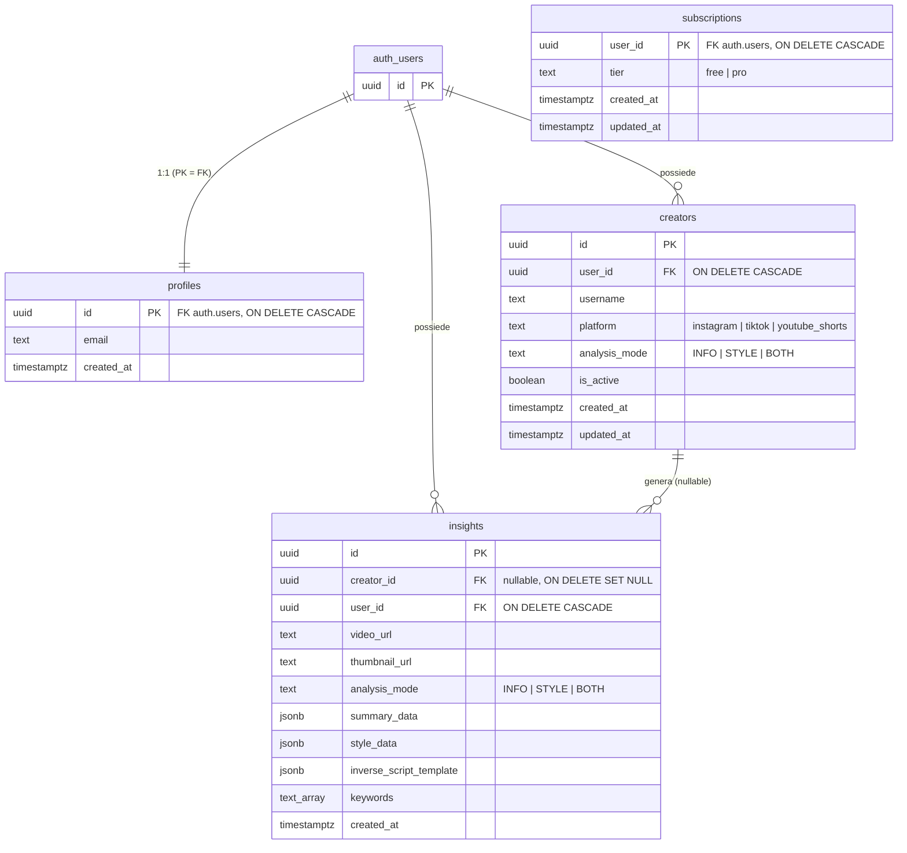

# Picox

SaaS che analizza video brevi (Reels, TikTok, YouTube Shorts) con AI multimodale
e ne estrae insight riutilizzabili: sintesi dei contenuti, analisi dello stile e
script inverso pronto da riadattare.

---

## Architettura

```
    browser                    Vercel                Render              servizi esterni
 ┌───────────┐          ┌────────────────┐    ┌──────────────────┐    ┌─────────────────┐
 │  Next.js  │─ JWT ───▶│    proxy.ts    │    │     FastAPI      │───▶│ Apify (scraping)│
 │  (PWA)    │          │  guardia auth  │    │                  │───▶│ Gemini (analisi)│
 └─────┬─────┘          └────────────────┘    └────────┬─────────┘    └─────────────────┘
       │                                               │
       │  Authorization: Bearer <JWT>                  │ anon key + JWT  → RLS attivo
       └──────────────────────────────────────────────▶│ service role    → RLS bypassato
                                                       ▼
                                            ┌──────────────────────┐
                                            │  Supabase (Postgres) │
                                            │  auth + RLS          │
                                            └──────────────────────┘
                                                       ▲
                                     X-CRON-SECRET     │
                                   ┌───────────────────┘
                                   │  scheduler (GitHub Actions / Render Cron)
```

Punti che spiegano il resto del codice:

- **Il browser non parla mai con Gemini o Apify.** Le chiavi vivono solo nel
  backend; il frontend conosce tre sole variabili, tutte `NEXT_PUBLIC_*` e tutte
  pubbliche per costruzione.
- **Due client Supabase, non intercambiabili.** Le richieste di un utente usano
  la anon key più il suo JWT, quindi il RLS resta attivo e un filtro dimenticato
  produce zero righe invece di una fuga di dati. La service role key —
  `BYPASSRLS` — serve solo dove un JWT non esiste (scrittura post-inferenza, job
  cron) e passa obbligatoriamente da `service_table(tabella, user_id)`, che
  impone da sé il filtro sul proprietario.
- **L'identità arriva sempre dal JWT verificato**, mai dal body o dalla query
  string. `AnalyzeVideoRequest` ha `extra="forbid"`: un `user_id` inviato dal
  client fa fallire la richiesta con 422 invece di essere ignorato in silenzio.
- **`UNIQUE (user_id, video_url)` è una cache.** Ogni analisi costa una chiamata
  Apify e un'inferenza Gemini; il vincolo rende impossibile pagarla due volte
  per lo stesso video. Perché regga, l'URL viene normalizzato prima di essere
  usato come chiave (vedi `media_service.normalize_video_url`).

### Struttura del monorepo

```
picox/
├── backend/                     API FastAPI + pipeline AI
│   ├── app/
│   │   ├── api/v1/              analyze · creators · insights · cron
│   │   ├── core/                config · security (JWT) · exceptions · observability
│   │   ├── middleware/          error_handler (SafeRoute) · request_context
│   │   ├── schemas/             modelli Pydantic (sono anche il response_schema di Gemini)
│   │   ├── services/            gemini · apify · media · supabase
│   │   └── cron_config.md       come schedulare il job periodico
│   ├── prompts/                 prompt Gemini, fuori dal codice applicativo
│   ├── scripts/check_env.py     verifica delle variabili d'ambiente all'avvio
│   ├── tests/                   suite pytest, nessuna chiamata di rete
│   ├── render.yaml              blueprint di deploy
│   └── pyproject.toml           configurazione di pytest, ruff e mypy
├── frontend/                    app Next.js 16 (App Router, PWA)
│   ├── app/ components/ lib/    UI, client API, tipi allineati al backend
│   ├── proxy.ts                 guardia di autenticazione (era `middleware.ts`)
│   ├── vercel.json  VERCEL.md   deploy
│   └── public/manifest.json     PWA + Web Share Target
├── supabase/migrations/         schema, RLS, trigger, indici
├── .claude/hooks/               controlli deterministici (segreti, lint, test)
├── .github/workflows/           CI: test, type check, scansione segreti
└── docker-compose.yml           backend in container, Supabase remoto
```

---

## Sviluppo locale

### Prerequisiti

Python 3.11+, Node 20+, un progetto Supabase (anche gratuito), una chiave
Gemini e un token Apify.

### 1. Applicare la migration

Con la [Supabase CLI](https://supabase.com/docs/guides/local-development):

```bash
supabase link --project-ref <project-ref>
supabase db push          # applica supabase/migrations/*.sql al progetto remoto
```

In alternativa, incollare `supabase/migrations/0001_init.sql` nell'SQL Editor
della dashboard ed eseguirlo in un'unica transazione.

Verifica: in **Table Editor** devono comparire `profiles`, `creators` e
`insights`, tutte con RLS abilitato. Se le tabelle non ci sono, tutto il resto
fallirà con errori poco leggibili.

### 2. Variabili d'ambiente

Due file distinti, e la distinzione è sostanziale.

**`backend/.env`** — copiare da `.env.example`. Contiene i segreti veri e non
viene mai committato:

| Variabile | Uso |
| --- | --- |
| `SUPABASE_URL` | URL del progetto Supabase |
| `SUPABASE_ANON_KEY` | Chiave pubblica, soggetta a RLS |
| `SUPABASE_SERVICE_ROLE_KEY` | **Bypassa il RLS** — solo server |
| `SUPABASE_JWT_SECRET` | *Solo* per progetti con JWT secret legacy (HS256). Vedi avvertenza sotto |
| `GEMINI_API_KEY` | Analisi multimodale |
| `GEMINI_MODEL` | Default `gemini-2.5-flash`; consigliato `gemini-flash-latest` |
| `APIFY_API_TOKEN` | Scraping Instagram / TikTok / YouTube Shorts |
| `CRON_SECRET` | Segreto dell'header `X-CRON-SECRET` |
| `FRONTEND_URL` | **Unico** origin ammesso dal CORS |
| `BACKEND_URL` | Base URL dell'API |

> **`SUPABASE_JWT_SECRET` vuota non equivale ad assente.** pydantic-settings
> legge `SUPABASE_JWT_SECRET=` come stringa vuota, non come `None`: il backend
> sceglie la verifica HS256 e su un progetto che firma in ES256 *ogni* richiesta
> autenticata risponde 401 — con la variabile che sembra configurata. Se il
> progetto usa chiavi asimmetriche, la riga va **rimossa del tutto**.
> `scripts/check_env.py` intercetta questo caso.

**`frontend/.env.local`** — copiare da `.env.local.example`. Solo tre variabili,
tutte pubbliche: Next.js sostituisce ogni `NEXT_PUBLIC_*` a build time con una
stringa letterale dentro il bundle servito al browser.

```
NEXT_PUBLIC_SUPABASE_URL=https://<ref>.supabase.co
NEXT_PUBLIC_SUPABASE_ANON_KEY=<chiave anon>
NEXT_PUBLIC_BACKEND_URL=http://localhost:8001
```

Nessun'altra variabile va aggiunta con quel prefisso: l'allowlist è verificata
dalla CI (`.github/scripts/scan-secrets.sh`) e da un hook locale.

### 3. Avviare

Due terminali. `NEXT_PUBLIC_BACKEND_URL` e la porta del backend devono
combaciare, e `FRONTEND_URL` lato backend deve essere l'origin del frontend:
sono gli stessi due valori visti dai due lati, ed è qui che nasce la maggior
parte degli errori CORS.

```bash
# backend — http://localhost:8001
cd backend
python -m venv .venv && .venv/Scripts/activate      # macOS/Linux: source .venv/bin/activate
pip install -r requirements.txt -r requirements-dev.txt
python scripts/check_env.py                          # verifica la configurazione
uvicorn app.main:app --reload --port 8001

# frontend — http://localhost:3000
cd frontend
npm install
npm run dev
```

`npm run dev` avvia **solo** il frontend: backend e frontend sono due processi
separati.

Con la documentazione interattiva attiva fuori produzione, l'API è esplorabile
su `http://localhost:8001/docs`.

### In alternativa: Docker

```bash
docker compose up --build          # backend su http://localhost:8001
```

Il compose avvia il solo backend e punta comunque al Supabase remoto: senza
quello l'autenticazione non funzionerebbe, perché i JWT vanno verificati contro
le chiavi di quel progetto. Verifica le variabili d'ambiente prima di avviare
uvicorn e si ferma con un messaggio esplicito se ne manca una. L'immagine
include `ffmpeg`, quindi qui il limite di **durata** dei video è applicato
davvero (fuori da Docker, senza `ffprobe`, resta attivo solo quello di
dimensione).

### Se qualcosa non funziona

| Sintomo | Causa quasi certa |
| --- | --- |
| 401 su tutto, anche subito dopo il login | `SUPABASE_JWT_SECRET` valorizzata a stringa vuota su un progetto ES256 |
| Errore CORS nella console del browser | `FRONTEND_URL` del backend ≠ origin da cui apri il sito (attenzione allo slash finale) |
| "Failed to fetch" dal frontend | Backend non avviato, o `NEXT_PUBLIC_BACKEND_URL` su una porta diversa |
| 503 sull'analisi | Chiave Gemini/Apify errata o modello ritirato — il traceback è nei log del backend, la risposta HTTP resta volutamente generica |
| Le tabelle risultano vuote | Migration mai applicata al progetto remoto |

---

## Qualità e test

```bash
cd backend
pytest                    # 73 test, nessuna chiamata di rete
ruff check .              # lint
mypy                      # type check

bash .github/scripts/scan-secrets.sh   # scansione segreti (dalla radice del repo)
```

La suite sostituisce Supabase con un doppio in memoria che **applica il RLS**:
un client costruito con la anon key filtra le righe sul `sub` del JWT, come
farebbero le policy vere. Una query scoped che perdesse il filtro sul tenant
farebbe fallire i test, invece di passare in verde e fallire in produzione.
Gemini, Apify e il download del media sono stub che contano le invocazioni —
così "sulla cache non richiama i servizi esterni" è una proprietà verificata e
non un'affermazione.

L'autenticazione **non** è sostituita da un override: i test firmano un JWT vero
e attraversano `verify_supabase_jwt`. Con un override i test sui 401 sarebbero
verdi per costruzione, cioè inutili.

La CI (`.github/workflows/backend-tests.yml`) esegue lint, type check, test,
build del frontend e scansione dei segreti. Quest'ultima gira su **ogni** push
senza filtri di path: il rischio maggiore è una chiave che finisce nel frontend,
e un filtro su `backend/**` renderebbe il controllo cieco proprio lì.

In locale, gli hook in `.claude/hooks/` applicano gli stessi controlli mentre si
lavora — dettagli e verifica in [`.claude/hooks/README.md`](.claude/hooks/README.md).

---

## Deploy

L'ordine conta: il backend deve esistere prima che il frontend possa puntarci,
ma il backend ha bisogno dell'URL del frontend per il CORS. Si chiude il cerchio
in tre passaggi.

### 1. Backend su Render

`backend/render.yaml` è un Blueprint pronto: build `pip install -r
requirements.txt`, start `uvicorn app.main:app --host 0.0.0.0 --port $PORT`,
health check su `/health`. Le variabili marcate `sync: false` vengono chieste al
primo deploy e non stanno nel repository; `CRON_SECRET` viene generata da Render.

`FRONTEND_URL` si può lasciare provvisoria: si corregge al passo 3.

> Il runtime Python di Render non include `ffmpeg`, quindi il limite di durata
> dei video non viene applicato (quello di dimensione sì, durante lo streaming).
> Per attivarlo si passa a `runtime: docker` — il `Dockerfile` è già pronto e il
> blocco da sostituire è commentato in fondo a `render.yaml`.

### 2. Frontend su Vercel

Root Directory **`frontend`** — è un monorepo, senza quell'impostazione il build
non parte. Le tre variabili `NEXT_PUBLIC_*` vanno inserite nel progetto, con
`NEXT_PUBLIC_BACKEND_URL` che punta al servizio Render.

Dettagli, e cosa non è esprimibile in `vercel.json`, in
[`frontend/VERCEL.md`](frontend/VERCEL.md).

### 3. Chiudere il cerchio

- Su Render: `FRONTEND_URL` = dominio Vercel, **senza slash finale e senza
  path** — il CORS confronta gli origin. Riavviare il servizio.
- Su Supabase → Authentication → URL Configuration: aggiungere il dominio Vercel
  ai *Redirect URLs*, altrimenti i link di conferma email rimandano a
  `localhost`.

> ⚠️ **Se in questa stessa schermata configurerete un SMTP proprio** (Supabase →
> Authentication → Emails → SMTP Settings), sappiate che state **rimuovendo una
> protezione**, e nulla ve lo segnalerà.
>
> Oggi il signup di massa è di fatto limitato dalla quota di invio dell'SMTP
> predefinito di Supabase — misurato: `HTTP 429 over_email_send_rate_limit`. Non
> è un controllo di sicurezza, è un limite del mittente condiviso, e sparisce con
> il primo provider proprio. Da quel momento la registrazione di N account
> automatizzati torna praticabile, e con essa il costo N × il tetto per utente.
>
> È la voce **A4** di [`SECURITY_AUDIT.md`](SECURITY_AUDIT.md), dove ci sono le
> quattro opzioni valutate (CAPTCHA, limite per IP o dominio, carta anche sul
> piano gratuito, tetto di spesa lato provider). **Nessuna è implementata.**
> Questa nota è qui, e non solo lì, perché chi configura l'SMTP sta guardando
> questa pagina — non l'audit.

Gli URL di preview di Vercel hanno un origin diverso per ogni branch e **non**
sono ammessi dal CORS: è voluto. Per provare un branch contro un backend reale
conviene un secondo servizio Render di staging con il proprio `FRONTEND_URL`.

### 4. Scheduling del cron

Il backend non ha uno scheduler interno: espone
`POST /api/v1/cron/check-updates`, autenticato con l'header `X-CRON-SECRET`, e
si aspetta che qualcuno lo chiami — ogni 6 ore è un buon punto di partenza.
L'operazione è idempotente, quindi un giro saltato viene recuperato dal
successivo.

Le tre opzioni (GitHub Actions, Render Cron, Vercel Cron), con i workflow pronti
da copiare e i rispettivi compromessi, sono in
[`backend/app/cron_config.md`](backend/app/cron_config.md). Vercel Cron richiede
una route di appoggio nel frontend, perché sa invocare solo path della stessa
applicazione Vercel.

---

## PWA e condivisione da mobile

`frontend/public/manifest.json` dichiara un **Web Share Target**: una volta
installata, Picox compare nel menu "Condividi" del sistema. Condividere un video
da TikTok o Instagram apre la dashboard con l'URL già nel campo di analisi,
senza copia-incolla.

```json
"share_target": {
  "action": "/dashboard",
  "method": "GET",
  "params": { "url": "shared_url", "text": "shared_text", "title": "shared_title" }
}
```

Il target riceve i parametri in query string; la dashboard li legge e precompila
il campo. Nessuna analisi parte da sola: serve comunque una conferma esplicita,
perché ogni analisi costa.

**Funziona su Android** (Chrome/Edge, ad app installata). **Non su iOS**: Safari
non implementa il Web Share Target, e su iPhone resta il copia-incolla del link.
Non è una svista né qualcosa che si possa aggirare lato applicazione.

In sviluppo il target non viene registrato: la registrazione richiede HTTPS e
l'installazione della PWA, quindi si prova solo sul dominio di produzione.

---

## Database Schema

### Panoramica



Tutte le tabelle vivono nello schema `public`; `auth.users` è gestita da
Supabase Auth (GoTrue).

### Tabelle

#### `profiles`

Estensione applicativa dell'utente, in relazione **1:1** con `auth.users`.

| Colonna | Tipo | Note |
| --- | --- | --- |
| `id` | `uuid` | PK **e** FK → `auth.users(id)` `ON DELETE CASCADE` |
| `email` | `text` | Copia denormalizzata da `auth.users`, nullable (signup via telefono) |
| `created_at` | `timestamptz` | `NOT NULL DEFAULT now()` |

> `subscription_tier` **non è più qui**: la migration `0006` l'ha spostata in
> `subscriptions.tier`. `profiles` contiene ciò che l'utente possiede e che un
> giorno potrà modificare; il piano è ciò che l'utente non decide, e vive in una
> tabella che non ha alcun motivo legittimo di essere scrivibile da un client.

La primary key coincide con l'ID dell'account: nessuna colonna `user_id`
separata, nessuna possibilità di profili orfani o duplicati.

**Popolamento automatico.** Il trigger `on_auth_user_created`
(`AFTER INSERT ON auth.users`) invoca `handle_new_user()` e inserisce la riga al
signup. La funzione è `SECURITY DEFINER` perché il trigger viene eseguito nel
contesto di `supabase_auth_admin`, che non ha privilegi su `public`; gira quindi
con quelli del proprietario (`postgres`). Ha `search_path = ''` per prevenire
search_path hijacking — vincolo che impone di qualificare ogni oggetto con lo
schema — e usa `ON CONFLICT (id) DO NOTHING`, così un profilo già esistente non
fa mai fallire il signup.

#### `subscriptions`

Stato di abbonamento, in relazione **1:1** con `auth.users`. Introdotta dalla
migration `0006`.

| Colonna | Tipo | Note |
| --- | --- | --- |
| `user_id` | `uuid` | PK **e** FK → `auth.users(id)` `ON DELETE CASCADE` |
| `tier` | `text` | `NOT NULL DEFAULT 'free'`, `CHECK IN ('free','pro')` |
| `created_at` | `timestamptz` | `NOT NULL DEFAULT now()` |
| `updated_at` | `timestamptz` | `NOT NULL DEFAULT now()`, aggiornata dal trigger `set_subscriptions_updated_at` |

**Nessun privilegio a `anon` e `authenticated`, nemmeno in lettura.** Non è una
dimenticanza: oggi il piano non serve a nessuno lato client — il frontend non
nomina piani in alcuna forma — e concedere una lettura che nessuno usa amplia la
superficie in cambio di nulla. Quando servirà mostrarlo nell'interfaccia bastano
un `grant select` e una policy di sola SELECT, entrambi già scritti in fondo alla
`0006`.

La scrittura resta preclusa **per costruzione**, non per configurazione: non
esiste alcuna operazione legittima con cui un client possa modificare il proprio
piano, quindi la tabella non ha bisogno di distinguere fra colonne modificabili e
no — al contrario di `profiles`, dove ogni colonna sensibile richiederebbe di
ricordarsi un trattamento a parte.

**L'assenza della riga vale `free`.** `enforce_creator_limit` applica un
`coalesce`, quindi il default sicuro non dipende dal fatto che qualcuno abbia
ricordato di inserire una riga. `handle_new_user()` **non** è stata estesa di
proposito: aggiungere un secondo insert al percorso di signup significherebbe un
modo in più di far fallire una registrazione, quando l'assenza porta già allo
stesso risultato.

#### `analysis_events`

Una riga per analisi **manuale avviata**. Introdotta dalla migration `0008`.

| Colonna | Tipo | Note |
| --- | --- | --- |
| `id` | `uuid` | PK, `DEFAULT gen_random_uuid()` |
| `user_id` | `uuid` | FK → `auth.users(id)` `ON DELETE CASCADE` |
| `video_url` | `text` | `NOT NULL` |
| `analysis_mode` | `text` | `CHECK IN ('INFO','STYLE','BOTH')` |
| `created_at` | `timestamptz` | `NOT NULL DEFAULT now()`; è la colonna su cui si conta la quota del giorno, in **UTC** |

**Avviata, non completata.** La riga viene scritta nel momento in cui la spesa è
decisa — dentro il lock, dopo i controlli di cache — quindi comprende anche le
analisi che pagano Apify e poi falliscono su Gemini, che **non lasciano alcuna
riga in `insights`**. Contare gli insight avrebbe sottostimato proprio l'abuso
che genera errori.

Il trigger `analysis_events_enforce_quota` rifiuta l'inserimento oltre
`analysis_limit_for_tier(tier)` analisi nel giorno corrente, sollevando `PX002`
che il backend traduce in `409 analysis_quota_reached`. **L'arbitro è il
database**: due richieste concorrenti al tetto non possono superarlo entrambe.

Il **cron non consuma questa quota** (`conta_quota=False`): ha già il proprio
budget dal tetto ai creator attivi. Due budget indipendenti.

Nessun privilegio ad `anon` e `authenticated`, RLS attivo senza policy — come
`analysis_locks`, `job_locks` e `subscriptions`. La tabella cresce senza limite e
andrà potata da un job periodico, per il quale `job_locks` è già generica sul
nome del job.

#### `creators`

Account monitorati da un utente; sorgente dello scraping periodico.

| Colonna | Tipo | Note |
| --- | --- | --- |
| `id` | `uuid` | PK, `DEFAULT gen_random_uuid()` |
| `user_id` | `uuid` | `NOT NULL`, FK → `auth.users(id)` `ON DELETE CASCADE` |
| `username` | `text` | `NOT NULL` |
| `platform` | `text` | `NOT NULL`, `CHECK IN ('instagram','tiktok','youtube_shorts')` |
| `analysis_mode` | `text` | `NOT NULL DEFAULT 'BOTH'`, `CHECK IN ('INFO','STYLE','BOTH')` |
| `is_active` | `boolean` | `NOT NULL DEFAULT true` — soft-switch del monitoraggio |
| `created_at` | `timestamptz` | `NOT NULL DEFAULT now()` |
| `updated_at` | `timestamptz` | `NOT NULL DEFAULT now()`, mantenuto dal trigger |

**Vincolo** `UNIQUE (user_id, username, platform)`: lo stesso creator può essere
monitorato da utenti diversi, ma una sola volta per utente. Rende idempotente
l'aggiunta lato backend (`ON CONFLICT ... DO NOTHING / DO UPDATE`).

**Trigger** `set_creators_updated_at` (`BEFORE UPDATE`) → `set_updated_at()`.
La funzione è volutamente generica: qualsiasi tabella futura con una colonna
`updated_at` può agganciarla senza duplicare codice.

`is_active = false` disattiva il creator dal cron **senza** cancellare la riga né
gli insight collegati: preferito alla DELETE come azione di default in UI.

#### `insights`

Output dell'analisi AI di un singolo video. È la tabella che cresce.

| Colonna | Tipo | Note |
| --- | --- | --- |
| `id` | `uuid` | PK, `DEFAULT gen_random_uuid()` |
| `creator_id` | `uuid` | **nullable**, FK → `creators(id)` `ON DELETE SET NULL` |
| `user_id` | `uuid` | `NOT NULL`, FK → `auth.users(id)` `ON DELETE CASCADE` |
| `video_url` | `text` | `NOT NULL` — chiave naturale del video |
| `thumbnail_url` | `text` | |
| `analysis_mode` | `text` | `NOT NULL`, `CHECK IN ('INFO','STYLE','BOTH')` — modalità effettivamente eseguita |
| `summary_data` | `jsonb` | Payload INFO |
| `style_data` | `jsonb` | Payload STYLE |
| `inverse_script_template` | `jsonb` | Script inverso riutilizzabile |
| `keywords` | `text[]` | `DEFAULT '{}'` — indicizzata GIN |
| `created_at` | `timestamptz` | `NOT NULL DEFAULT now()` |

I tre payload sono `jsonb` e non colonne tipizzate: la forma dell'output del
modello evolve più in fretta dello schema, e `jsonb` assorbe le variazioni senza
migration. `keywords` resta invece un `text[]` di primo livello proprio perché è
il campo su cui si filtra.

`analysis_mode` è ridondante rispetto a `creators.analysis_mode` **di proposito**:
registra la modalità con cui quel video è stato effettivamente analizzato, che
resta valida anche se in seguito l'utente cambia la preferenza sul creator o se
l'insight arriva da link singolo (nessun creator).

### Relazioni

| Da | A | Cardinalità | On delete |
| --- | --- | --- | --- |
| `profiles.id` | `auth.users.id` | 1:1 | `CASCADE` |
| `creators.user_id` | `auth.users.id` | 1:N | `CASCADE` |
| `insights.user_id` | `auth.users.id` | 1:N | `CASCADE` |
| `insights.creator_id` | `creators.id` | 1:N (opzionale) | `SET NULL` |

La cancellazione dell'account rimuove per cascata profilo, creator e insight:
un solo `DELETE` su `auth.users` soddisfa una richiesta di cancellazione dati.

### Indici

| Indice | Definizione | Perché |
| --- | --- | --- |
| `insights_keywords_idx` | `GIN (keywords)` | Ricerca per keyword con `@>`, `&&`, `<@` senza scansione della tabella |
| `creators_user_id_idx` | `btree (user_id)` | Scoping per tenant: dashboard e ciclo del cron |
| `insights_user_id_idx` | `btree (user_id)` | Scoping per tenant: feed dell'utente |
| `insights_creator_id_idx` | `btree (creator_id)` | Feed di un singolo creator; evita il seq scan che il `SET NULL` in cascata richiederebbe a ogni DELETE su `creators` |
| `insights_video_url_idx` | `btree (video_url)` | Lookup per URL a prescindere dall'utente |
| `insights_user_id_video_url_key` | `UNIQUE (user_id, video_url)` | Vincolo di cache (sotto) — copre anche le query con prefisso `user_id` |
| `creators_user_id_username_platform_key` | `UNIQUE (user_id, username, platform)` | Idempotenza dell'aggiunta creator |

Gli indici su `user_id` non servono solo alle query applicative: le policy RLS
aggiungono un predicato `user_id = auth.uid()` a **ogni** statement, quindi sono
il percorso di accesso di fatto della tabella.

### Scelte di design

#### `UNIQUE (user_id, video_url)` — cache anti-duplicati

Ogni analisi costa: una chiamata di scraping ad Apify e un'inferenza multimodale
su Gemini. Il vincolo rende impossibile, a livello di database, avere due righe
per lo stesso video dello stesso utente.

Il flusso lato backend diventa:

1. `SELECT` su `(user_id, video_url)`;
2. **cache hit** → si restituisce la riga esistente, zero chiamate esterne;
3. **cache miss** → scraping, analisi, `INSERT ... ON CONFLICT (user_id, video_url) DO NOTHING`.

Lo step 3 chiude anche la race condition fra due richieste concorrenti sullo
stesso video: la seconda viene assorbita dal vincolo invece di duplicare la riga.

La chiave è per utente, non globale: due utenti che analizzano lo stesso video
ottengono due righe indipendenti. È voluto — isolamento dei dati, ognuno resta
padrone dei propri insight e può cancellarli senza toccare quelli altrui.
L'indice `insights_video_url_idx` lascia comunque aperta la porta a un
riutilizzo cross-tenant dell'output AI (copiare il payload già calcolato in una
nuova riga invece di rieseguire l'inferenza), come ottimizzazione applicativa
futura e non come condivisione di righe.

> Nota: `video_url` è la chiave naturale, quindi va **normalizzata prima della
> scrittura** (rimozione di `?igshid=`, `utm_*`, slash finale, host equivalenti).
> Senza normalizzazione lo stesso video con due URL diversi supera il vincolo e
> paga due volte l'analisi. Responsabilità del backend.

#### `ON DELETE SET NULL` su `insights.creator_id`

`creator_id` è nullable e sopravvive alla cancellazione del creator per due
motivi:

- **l'insight ha valore proprio.** È già stato pagato in token AI e può essere
  già stato letto, esportato o riusato dall'utente. Smettere di monitorare un
  account è un'azione di gestione della watchlist, non una richiesta di
  cancellare l'archivio: un `CASCADE` distruggerebbe silenziosamente storico e
  budget speso.
- **coerenza con l'ingestione da link singolo.** Un video incollato a mano non
  ha alcun creator associato, quindi la colonna deve essere nullable comunque.
  `SET NULL` fa convergere i due casi su un unico stato — *insight senza creator*
  — invece di introdurre un secondo significato per la stessa colonna.

Contrasta con `user_id`, che è `NOT NULL` + `CASCADE`: un insight senza
proprietario non ha significato ed è un rischio di data retention, quindi lì la
cancellazione deve propagarsi.

### Row Level Security

RLS abilitato su `profiles`, `creators`, `insights`. Per ogni tabella quattro
policy separate — `SELECT`, `INSERT`, `UPDATE`, `DELETE` — tutte `TO authenticated`:

| Tabella | Predicato |
| --- | --- |
| `profiles` | `auth.uid() = id` |
| `creators` | `auth.uid() = user_id` |
| `insights` | `auth.uid() = user_id` |

Dettagli implementativi:

- **una policy per comando** anziché `FOR ALL`: rende esplicito cosa è concesso e
  permette di revocare un singolo permesso senza riscrivere il resto;
- **`WITH CHECK` su INSERT e UPDATE**, non solo `USING`: senza di esso un utente
  potrebbe riassegnare una propria riga a un altro `user_id`;
- **`(select auth.uid())` invece di `auth.uid()`**: PostgreSQL valuta la subquery
  una volta sola come InitPlan invece che per ogni riga — differenza sostanziale
  sulle scansioni ampie;
- **`anon` non ha privilegi** sulle tre tabelle (`REVOKE ALL`): nessun dato di
  Picox è pubblico;
- le policy di `insights` verificano inoltre che `creator_id` sia `NULL` oppure
  punti a un creator **dello stesso utente**. Senza questo controllo un client
  autenticato potrebbe agganciare i propri insight al creator di un altro tenant:
  non espone dati, ma corrompe l'integrità referenziale fra tenant.

#### La Service Role Key bypassa il RLS — by design

Il ruolo `service_role`, usato dal backend con `SUPABASE_SERVICE_ROLE_KEY`, ha
l'attributo `BYPASSRLS`: **nessuna policy di questo schema viene valutata**. È il
comportamento voluto — il backend deve poter scrivere per conto di un utente in
contesti dove non esiste un JWT, come il cron di scraping — ed è anche l'unico
punto in cui l'isolamento fra tenant non è garantito dal database.

**Conseguenza operativa (responsabilità dell'Agente 2 / backend):**

> Ogni query eseguita con il client service-role **deve filtrare manualmente su
> `user_id`** (`id` per `profiles`), con l'ID ricavato dal JWT già verificato —
> mai da un parametro della request.

```js
// OK — scoping esplicito, ID dalla sessione verificata
await db.from('insights').select('*').eq('user_id', userIdFromJwt);

// NO — restituisce gli insight di tutti gli utenti
await db.from('insights').select('*');

// NO — l'ID arriva dal client: IDOR
await db.from('insights').select('*').eq('user_id', req.body.userId);

// NO — la PK da sola non basta: un UUID indovinato o trapelato
//      permette la scrittura cross-tenant
await db.from('insights').delete().eq('id', insightId);

// OK — PK + scoping
await db.from('insights').delete().eq('id', insightId).eq('user_id', userIdFromJwt);
```

Regole di contorno:

- `SUPABASE_SERVICE_ROLE_KEY` non deve mai raggiungere il browser né comparire in
  variabili d'ambiente pubbliche (`NEXT_PUBLIC_*`, `VITE_*`);
- dove non serve il bypass — cioè in tutte le richieste che arrivano da un utente
  loggato — è preferibile un client creato con la anon key e il JWT dell'utente:
  in quel caso il RLS resta la rete di sicurezza e un filtro dimenticato non
  diventa una fuga di dati;
- gli endpoint invocati dallo scheduler si autenticano con `CRON_SECRET` e non
  devono accettare un `user_id` arbitrario dall'esterno: lo ricavano da
  `creators`.

### Note per l'evoluzione dello schema

- `insights.keywords` è nullable (`DEFAULT '{}'`, come da specifica): il backend
  deve scrivere sempre un array, anche vuoto. Se in futuro si preferisce blindare
  l'invariante, `SET NOT NULL` è una migration non distruttiva dopo un backfill
  dei `NULL` a `'{}'`.
- L'integrità cross-tenant di `insights.creator_id` è oggi garantita dalle policy
  RLS, che il backend service-role bypassa. Se serve un vincolo valido **anche**
  per il service-role, la forma canonica è un `UNIQUE (id, user_id)` su
  `creators` più una FK composita
  `FOREIGN KEY (creator_id, user_id) REFERENCES creators (id, user_id) ON DELETE SET NULL (creator_id)`
  (la sintassi con lista di colonne nel `SET NULL` richiede PostgreSQL 15+).
- Quando `insights` cresce, i candidati naturali sono un indice
  `(user_id, created_at DESC)` per la paginazione del feed e la ricerca full-text
  sui payload `jsonb`.
